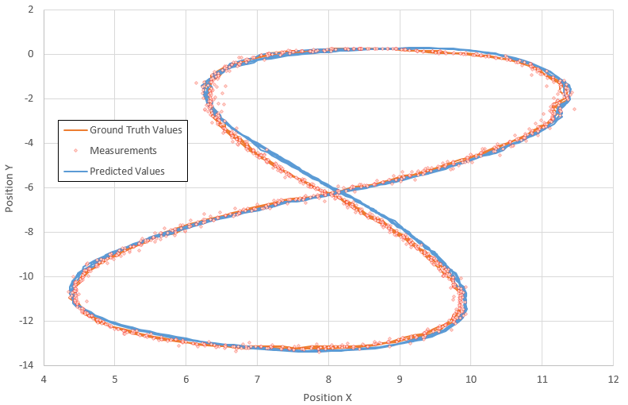
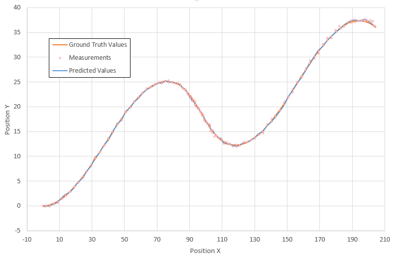

# Unscented Kalman Filter Project 
Udacity Self-Driving Car Engineer Nanodegree Program

---

## Dependencies

* cmake >= v3.5
* make >= v4.1
* gcc/g++ >= v5.4

## Basic Build Instructions

1. Clone this repo.
2. Make a build directory: `mkdir build && cd build`
3. Compile: `cmake .. && make`
4. Run it: `./UnscentedKF path/to/input.txt path/to/output.txt`. You can find
   some sample inputs in 'data/'.
    - eg. `./UnscentedKF ../data/sample-laser-radar-measurement-data-1.txt output.txt`

## Code Style

It's been tried to stick to [Google's C++ style guide](https://google.github.io/styleguide/cppguide.html) as much as possible.

## Results for dataset #1

The following image presents the results obtained on the first data file. The ground truth values of Px and Py along with the predicted values (i.e. using UKF) and the measurement values are shown on the image below. RMSE values of **0.085344**, **0.0873828**, **0.649494** and **0.58687** were obtained for Px, Py, Px_dot, and Py_dot.

## Results for dataset #2

The following image presents the results obtained on the second data file. The ground truth values of Px and Py along with the predicted values (i.e. using UKF) and the measurement values are shown on the image below. RMSE values of **0.181135**, **0.182171**, **0.329967** and **0.531821** were obtained for Px, Py, Px_dot, and Py_dot.

## Other Considerations

Calculation of the square root of the matrix was the tricky part. In order to avoid numerical instabilities, the suggestions provided [here](https://discussions.udacity.com/t/numerical-instability-of-the-implementation/230449) were implemented.
