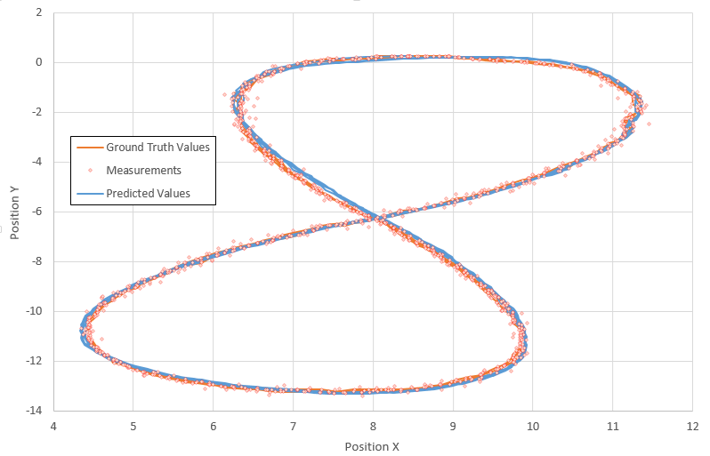

# Unscented Kalman Filter Project 
Udacity Self-Driving Car Engineer Nanodegree Program

---

## Dependencies

* cmake >= v3.5
* make >= v4.1
* gcc/g++ >= v5.4

## Basic Build Instructions

1. Clone this repo.
2. Make a build directory: `mkdir build && cd build`
3. Compile: `cmake .. && make`
4. Run it: `./UnscentedKF path/to/input.txt path/to/output.txt`. You can find
   some sample inputs in 'data/'.
    - eg. `./UnscentedKF ../data/sample-laser-radar-measurement-data-1.txt output.txt`

## Code Style

It's been tried to stick to [Google's C++ style guide](https://google.github.io/styleguide/cppguide.html) as much as possible.

## Results-1

The following image presents the results obtained on the first datafile. The ground truth values of Px and Py along with the predicted values (i.e. using UKF) and the measurement values are shown on the image. RMSE values of 0.085344, 0.0873828, 0.649494 and 0.58687 were obtained for Px, Py, Px_dot, and Py_dot.

